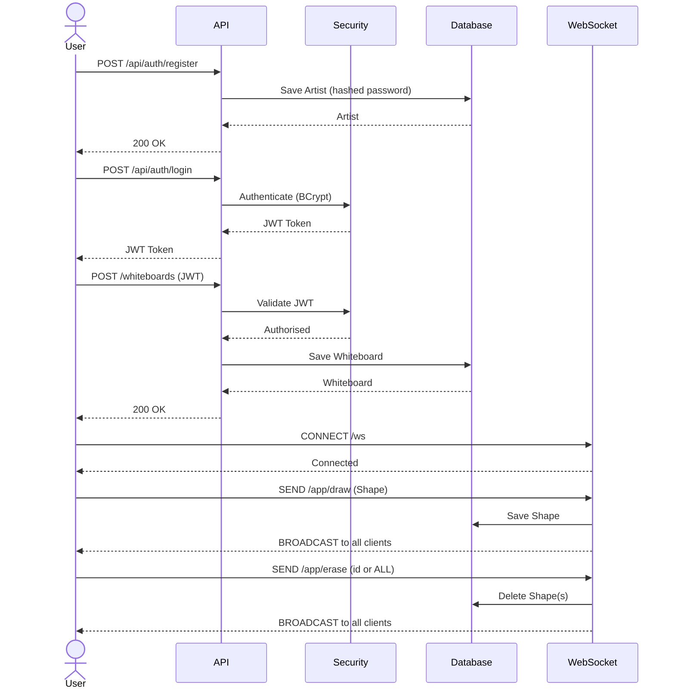

```mermaid
sequenceDiagram
    actor User
    participant API
    participant Security
    participant Database
    participant WebSocket
    %% Register
    User->>API: POST /api/auth/register
    API->>Database: Save Artist (hashed password)
    Database-->>API: Artist
    API-->>User: 200 OK
    %% Login
    User->>API: POST /api/auth/login
    API->>Security: Authenticate (BCrypt)
    Security-->>API: JWT Token
    API-->>User: JWT Token
    %% Create Whiteboard
    User->>API: POST /whiteboards (JWT)
    API->>Security: Validate JWT
    Security-->>API: Authorised
    API->>Database: Save Whiteboard
    Database-->>API: Whiteboard
    API-->>User: 200 OK
    %% Realtime Drawing
    User->>WebSocket: CONNECT /ws
    WebSocket-->>User: Connected
    User->>WebSocket: SEND /app/draw (Shape)
    WebSocket->>Database: Save Shape
    WebSocket-->>User: BROADCAST to all clients
    %% Erase
    User->>WebSocket: SEND /app/erase (id or ALL)
    WebSocket->>Database: Delete Shape(s)
    WebSocket-->>User: BROADCAST to all clients
```
